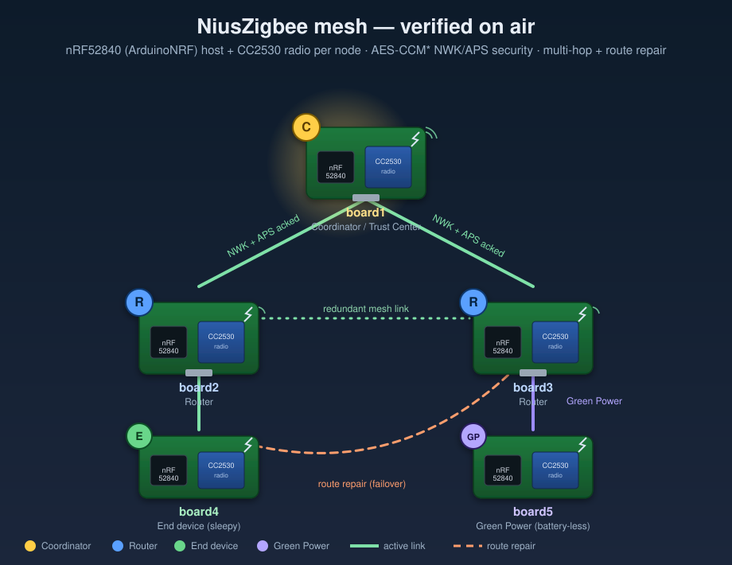

# ⚡ NiusZigbee

> **A complete Zigbee 3.0 / Zigbee PRO stack on two cheap chips.**
> An **ArduinoNRF (nRF52840)** drives an AliExpress **CC2530** radio over UART — and
> runs the entire Zigbee stack itself: scan & join, self-healing mesh routing,
> AES-CCM* NWK/APS security, commissioning, Green Power, and a dozen ZCL clusters.
> **No TI Z-Stack, no gateway, no cloud.** Flash the radio once, then it's just an
> Arduino sketch.


The companion to the [ArduinoNRF](https://github.com/dunknowcoding/ArduinoNRF)
board package, kept as a **separate library** so the board package stays small.

## Why it's different

- 🧠 **The whole stack runs on the host MCU** — the $1 CC2530 is just a PHY/MAC
  radio; NWK, APS, ZCL, ZDO, security and routing all live on the nRF52840.
- 🔓 **No vendor stack required** — a clean-room SDCC transceiver firmware, flashed
  once over the debug port by the board package's built-in `CCDebugger`.
- 🔁 **Two backends, one API** — run the native host stack, or drive a CC2530
  running **TI Z-Stack ZNP** as a certified coprocessor.
- 📡 **TI-grade MAC reliability** — IEEE 802.15.4 unslotted **CSMA-CA**,
  **MAC-level ACK + retransmit**, and **energy-detect scan** in the radio firmware:
  the same channel-access, per-hop reliability, and channel-sensing the official
  Z-Stack MAC uses (verified recovering frames under congestion on the bench).
- 🛠️ **Hardware-proven** — bring-up across up to 5 boards: a 3-hop line, a
  self-healing 2×2 mesh, Green Power, and source-routed delivery.

## What it does

- **Raw 802.15.4** send / receive / sniff on the CC2530, with a bundled SDCC
  transceiver firmware (no TI Z-Stack needed; the module is flashed once over its
  debug port by the board package's built-in `CCDebugger`).
- **A complete Zigbee 3.0 / Zigbee PRO stack, host-side on the nRF52840:** active
  scan + join, AODV routing + source routing, multi-hop forwarding, AES-CCM*
  **NWK and APS** security (on the nRF hardware AES), end-to-end acked delivery,
  multi-hop APS **fragmentation**, group multicast, binding, persistence,
  Trust-Center key transport + rotation + install codes, BDB / finding-and-binding
  / **Touchlink** commissioning, **Green Power** (battery-less devices), a dozen
  ZCL device clusters, and ZDO network management — the full Zigbee PRO surface.
- **Two module backends:** the native host stack above (default), or drive a
  CC2530 running **TI Z-Stack ZNP** as a certified-stack coprocessor over the MT
  API (`CC2530ZnpRadio`).
- **Verified on air on up to 5 boards** (ProMicro clones + nice!nano v2): a 3-hop
  line at **100%** delivery, a self-healing 2×2 mesh, mesh + Green Power, and
  source-routed delivery. → details in [docs/VERIFIED_BEHAVIOR.md](docs/VERIFIED_BEHAVIOR.md).

## How it works

```text
   ArduinoNRF (nRF52840)                         CC2530 module
   ┌───────────────────┐    UART  115200    ┌────────────────────┐
   │ CC2530Radio (this │  D0 ─► P0.2 (RX)   │  SDCC 802.15.4     │
   │ library)          │  D1 ◄─ P0.3 (TX)   │  transceiver fw    │──))) 2.4 GHz
   │                   │                    │                    │
   │ CCDebugger (board │  D8 ─► P2.1 (DD)   │  (flashed once via │
   │ package) flashes  │  D9 ─► P2.2 (DC)   │   the debug port)  │
   │ the module        │  D10─► RST         │                    │
   └───────────────────┘                    └────────────────────┘
```

- **Flashing** the module needs no external programmer — the board package's
  built-in **`CCDebugger`** does it over the 2-wire debug port.
- **At runtime** the nRF talks to the module over UART with a small framed
  protocol; the CC2530 does the radio PHY/MAC, the nRF does everything above it.

## Mesh topology

Each node is one **nRF52840 + CC2530** pair. The library forces a chosen shape on
a bench of co-located radios with depth-filtered joins + IEEE
association-ignore lists, so the same boards can play coordinator, router, end
device, or Green Power sink. All four shapes below are verified on hardware
([evidence](docs/VERIFIED_BEHAVIOR.md#multi-board-topologies-45-boards-on-air)).



| Topology | Build flag | What it shows |
|----------|-----------|---------------|
| **3-hop line** board1→board2→board3→board4 | `-DNIUS_ZIGBEE_LINE_TOPO=1` | APS-acked data across 3 hops and back at **100%** (`aps[q=15 ok=15 drop=0]`) |
| **2×2 mesh + route repair** | `-DNIUS_ZIGBEE_MESH_TOPO=1` | board2/board3 redundant routers; board4 self-heals onto the other router when its parent is silenced |
| **Mesh + Green Power** | `-DNIUS_ZIGBEE_GP_SINK=1` | board1 runs the mesh **and** sinks board5's battery-less Green Power frames |
| **Source-route OTA** (NWK-secured) | `-DNIUS_ZIGBEE_SOURCEROUTE=1` | board4's Route Record walks up the line; board1 source-routes a frame back down, secured per hop with the relay index AAD-excluded |

> board4/board5 are **nice!nano v2 (S140)** boards — the SoftDevice sits dormant,
> the hardware AES is free, and the full stack runs identically to the
> no-SoftDevice ProMicro boards.

## Install

1. Install the **ArduinoNRF board package** (provides the board + the
   `CCDebugger` flasher).
2. Install **this library** — *Sketch ▸ Include Library ▸ Add .ZIP Library…*,
   clone into your Arduino `libraries/` folder, or via Library Manager (published
   as **NiusZigbee**; the repo keeps the `ArduinoNRF-Zigbee` name).

## Quick start

1. **Wire it up** — debug pins (D8/D9/D10) and UART pins (D0/D1), 3.3 V only. See
   [docs/WIRING.md](docs/WIRING.md). `P2.0 (CFG1)` is unused by this firmware;
   leave it floating or tie to GND.
2. **Flash the module firmware once** — *Examples ▸ ArduinoNRF-Zigbee ▸
   **CC2530_FlashFirmware*** (uses the built-in CC-Debugger;
   [docs/FLASHING.md](docs/FLASHING.md)).
3. **Use it** — start with **CC2530_Info** (confirm the link), **CC2530_Sniffer**
   (packet sniffer), or **CC2530_Link** (two-node radio link). The full mesh demo
   is **CC2530_BeaconJoin** (scan/join, routing, multi-hop, NWK security, acked
   APS); build the roles with `-DNIUS_ZIGBEE_THIS_NODE=0x0001/0x0002/0x0003` and
   the topology flags above. See [examples/](examples/) for the complete set,
   including ZCL cluster demos and the single-board protocol self-tests.

```cpp
#include <CC2530Radio.h>
CC2530Radio radio;                 // uses Serial1 (D0/D1)

void onFrame(const uint8_t* p, uint8_t n, int8_t rssi, uint8_t lqi) { /* ... */ }

void setup() {
  radio.begin(11);                 // 115200 UART, channel 11
  radio.onReceive(onFrame);
}
void loop() {
  radio.poll();
  radio.send((const uint8_t*)"hi", 2);
}
```

> **Board layout note:** some nice!nano-compatible bootloaders report
> `SoftDevice: not found` in `INFO_UF2.TXT`. For those, select the no-SoftDevice
> bootloader option (`bootloader=promicroserialnosd`) so the sketch links at
> `0x1000`. A SoftDevice layout can upload but never starts.

## API (`CC2530Radio`)

| Method | Purpose |
|--------|---------|
| `begin(channel=11, baud=115200)` | open the UART, ping, select channel |
| `ping()` / `firmwareVersion()` | liveness check / firmware version |
| `setChannel(11..26)` / `channel()` | select / read the 802.15.4 channel |
| `setPromiscuous(bool)` | receive all frames (sniffer) vs filtered |
| `setAddress(pan, short, ieee)` | program CC2530 PAN ID, short address, IEEE address |
| `configureMac(flags, retries)` / `getMacInfo(info)` | hardware filtering, Auto ACK, CCA TX, retry count |
| `setTxPowerRaw(value)` | write the CC2530 TXPOWER register |
| `send(payload, len)` | transmit a raw 802.15.4 frame (radio adds FCS) |
| `sendWithRetries(payload, len, retries)` / `lastTxAttempts()` | transmit with retries + attempt count |
| `sendData(...)` / `onDataReceive(cb)` | short-address 802.15.4 **MAC** data frames |
| `sendNwkData(...)` / `onNwkReceive(cb)` | simple Zigbee **NWK** data frames |
| `sendNwkCommand(...)` / `onNwkCommandReceive(cb)` | NWK command frames (Route Request/Reply, Status, Leave, Rejoin) |
| `sendApsData(...)` / `onApsReceive(cb)` | unicast Zigbee **APS** data frames |
| `sendZdoCommand(...)` / `onZdoReceive(cb)` | **ZDO** (endpoint 0 / profile 0) frames |
| `sendZclCommand(...)` / `onZclReceive(cb)` | basic **ZCL** command frames |
| `onReceive(cb)` + `poll()` | deliver raw received frames to your callback |

`send()` carries **raw 802.15.4** — perfect for CC2530↔CC2530 links and sniffing.
The `sendData`/`sendNwk*`/`sendAps*`/`sendZdo*`/`sendZcl*` families add each
successive Zigbee frame layer on top of that MAC base. The higher-level stack
(scan/join, routing, security, commissioning, clusters) is provided by the
`Zigbee*` classes summarized below; the per-class layering story is in
[docs/STACK_ROADMAP.md](docs/STACK_ROADMAP.md).

## Zigbee PRO networking & security

Layered on the MAC base; each piece ships with a hardware self-test example.

- **NWK security.** `ZigbeeSecurity` protects every NWK frame with AES-CCM*
  ENC-MIC-32 (Zigbee aux header, on-air level zeroing, frame-counter replay
  table) on the nRF52840 hardware AES. The CCM* core (`ZigbeeCcmStar.h`) is
  shared with APS.
- **APS reliability.** `ZigbeeApsRetransmit` + `ZigbeeApsDuplicateTable` give
  end-to-end acked delivery with retransmit + duplicate rejection;
  `ZigbeeApsFragment` splits/reassembles oversized payloads.
- **Trust-Center key transport.** `ZigbeeApsKey` + `ZigbeeApsSecurity`:
  Transport-Key / Request-Key / Switch-Key, AES-MMO hash, HMAC-MMO, specialized
  key derivation, APS CCM* envelope. Wired into the join via
  `-DNIUS_ZIGBEE_SECURE_JOIN=1` (HW-verified end to end; needs CC2530 fw v0.4).
- **Routing & forwarding.** `ZigbeeRouting` runs AODV (RREQ/RREP, reverse
  routes); the example forwards multi-hop unicast with per-hop re-encryption.
- **Network management.** ZDO `Mgmt_Lqi` / `Mgmt_Rtg`, `ZigbeeBroadcastTable`
  (dedup + passive-ack), `ZigbeePanIdConflict`.
- **Sleepy end devices.** `ZigbeeMac::buildDataRequest` + `ZigbeeIndirectQueue` +
  `ZigbeeEndDeviceTimeout` (keep-alive negotiation).
- **Persistence & binding.** `ZigbeePersistence` (network identity + frame
  counter, anti-replay across reboots); `ZigbeeBindingTable` (ZDO Bind/Unbind).
- **Source routing.** `ZigbeeSourceRouteTable` + Route Record collection +
  concentrator-originated source-routed data frames.
- **Groups & app encryption.** `ZigbeeGroupTable` + `ZigbeeGroupsCluster`;
  `ZigbeeApsSecurity::secureDataFrame` adds an APS link-key envelope over NWK.
- **Commissioning (BDB / Touchlink).** `ZigbeeBdb`, `ZigbeeFindingBinding`,
  `ZigbeeInstallCode`, `ZigbeeTouchlink` (with a software AES-128 inverse cipher,
  since the nRF ECB is encrypt-only), `ZigbeeInterPan`.
- **Green Power.** `ZigbeeGreenPower` (GPDF + AES-CCM* + commissioning) +
  `ZigbeeGpSinkTable` (frame-counter replay protection), plus `ZigbeeGpProxy` +
  the GP cluster (0x0021) `ZigbeeGreenPowerCluster` to tunnel a battery-less
  device across the mesh to a distant sink.
- **ZCL device clusters.** Basic, Identify, Groups, Scenes, On/Off, Level
  Control, Color Control, Thermostat, Window Covering, Door Lock, IAS Zone,
  Occupancy Sensing, Temperature / Relative-Humidity / Electrical Measurement,
  OTA Upgrade, attribute reporting, and a `ZigbeeLight` device abstraction, each
  exercised by a hardware self-test example.

## Current stack boundary

NiusZigbee implements the full Zigbee 3.0 / Zigbee PRO surface on top of the SDCC
CC2530 MAC/PHY backend (MAC frames/association/filtering · NWK scan/join/route/
source-route/security · APS acked delivery/fragmentation/groups/app encryption ·
TC key transport + rotation + install codes + BDB/Touchlink commissioning · ZDO
discovery + management + binding · the ZCL clusters above (On/Off, Level, Color,
Thermostat, Window Covering, Door Lock, IAS Zone, Occupancy, Temperature /
Humidity / Electrical Measurement, OTA) + Green Power).

It is **not** certified Zigbee PRO (that needs the official test harness), but the
technical surface is complete. Source-routed frames are NWK-secured on air — the
mutable relay-index byte is excluded from the CCM* AAD, so a relay can advance it
and re-secure under its own aux header without breaking the MIC
(`radio.sendNwkDataSourceRouted()`). Sleepy-child support is done end to end: the
host queues indirect traffic and the CC2530 firmware sets the auto-ACK
frame-pending bit (`FRMCTRL1.PENDING_OR`, via `radio.setFramePending()`) so a
polling child learns when data is waiting.

The CC2530 transceiver firmware now carries the same channel-access and per-hop
reliability the official Z-Stack MAC uses: IEEE 802.15.4 unslotted **CSMA-CA**
(random exponential backoff before TX), **MAC-level ACK + retransmit** (wait for
the ACK, retransmit up to `macMaxFrameRetries`), and live **MAC reliability
counters** (`mac[retx noack]`) so per-hop delivery is observable on the bench. A
**second backend** lives beside the raw driver — `CC2530ZnpRadio` drives a CC2530
running TI Z-Stack ZNP over the MT API. Milestone status and on-air evidence:
[docs/STACK_ROADMAP.md](docs/STACK_ROADMAP.md) ·
[docs/VERIFIED_BEHAVIOR.md](docs/VERIFIED_BEHAVIOR.md).

## Extending to new modules

Drop a driver in `src/modules/<NAME>/`, its firmware in
`extras/firmware/<name>/`, a forwarder header in `src/`, and examples under
`examples/`. See [src/ZigbeeModule.h](src/ZigbeeModule.h). The built-in
`CCDebugger` flashes any TI CC253x image (SDCC or Z-Stack).

## Firmware

The CC2530 transceiver firmware source (SDCC) and prebuilt binary live in
[extras/firmware/cc2530/](extras/firmware/cc2530/). Build notes:
[extras/firmware/cc2530/BUILD.md](extras/firmware/cc2530/BUILD.md).

## License

Apache 2.0 — see [LICENSE](LICENSE). Author: **dunknowcoding** (YouTube:
*NiusRobotLab*). If you use it in a product, please credit the original author and
note your changes.
